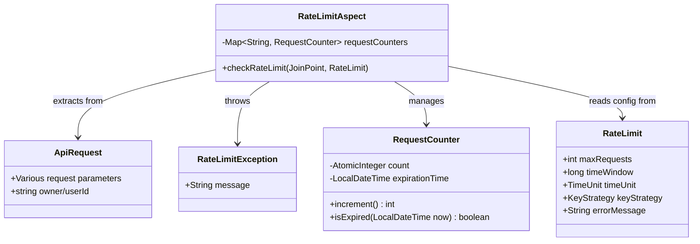

## Requirements
Add rate limiting functionality to the API without redis, restricting the same user from making identical requests more than a limited number of times within a specified time window. Exceeding this limit will result in an error response.

## Business Model

## Solution Approach
1. Implement rate limiting using AOP:
    - Create a custom `@RateLimit` annotation to configure rate limiting parameters
    - Implement an AOP aspect to intercept methods with the `@RateLimit` annotation
    - Decouple annotation mechanism from business logic to improve code maintainability

2. Custom Annotation Design:
    - Support configuration of maximum request count, time window size and unit
    - Support configuration of rate limiting key generation strategies (based on user and content or user only)
    - Support custom error messages

3. Flexible Rate Limiting Key Generation:
    - Support two key generation strategies: USER_CONTENT (based on user + content) and USER (based on user only)
    - Use USER_CONTENT strategy by default to limit requests with the same content from the same user

4. Counter Management:
    - Use thread-safe ConcurrentHashMap to store counters
    - Maintain a counter object for each unique request hash
    - Implement automatic expiration and cleanup mechanism

## Structure

### Inheritance Relationships
1. RateLimitAspect implements AOP aspect, responsible for intercepting methods with @RateLimit annotation
2. RateLimitException extends RuntimeException

### Dependency Relationships
1. RateLimitAspect depends on @RateLimit annotation
2. Business service implementation methods use @RateLimit annotation

## Tasks

### Create RateLimit Annotation
1. Properties:
    - maxRequests: int - Maximum number of requests, configurable with default value
    - timeWindow: long - Time window value, configurable with default value
    - timeUnit: TimeUnit - Time window unit, default MINUTES
    - keyStrategy: KeyStrategy - Rate limiting key generation strategy, default USER_CONTENT
    - errorMessage: String - Error message, with default value
2. Meta-annotations:
    - @Target(ElementType.METHOD) - Can only be applied to methods
    - @Retention(RetentionPolicy.RUNTIME) - Retained at runtime
3. Nested enum KeyStrategy:
    - USER_CONTENT - Generate rate limiting key based on user and request content
    - USER - Generate rate limiting key based on user only

### Create RateLimitException Class
1. Properties:
    - message: String
2. Constructor:
    - Use annotation @ResponseStatus(HttpStatus.TOO_MANY_REQUESTS)
    - Call parent constructor super(message)

### Create RateLimitAspect Aspect Class
1. Annotations:
    - @Aspect - Mark as aspect
    - @Component - Register as Spring component
2. Properties:
    - requestCounters: ConcurrentHashMap<String, RequestCounter>
3. Methods:
    - checkRateLimit(JoinPoint joinPoint, RateLimit rateLimit): void
        - Use @Before("@annotation(rateLimit)") to intercept methods with @RateLimit annotation
        - Extract request object from method parameters
        - Calculate request hash based on strategy
        - Get or create counter and increment count
        - Throw RateLimitException if limit is exceeded
4. Helper methods:
    - findRequestParam(JoinPoint joinPoint): Object
    - calculateRequestHash(Object request, KeyStrategy keyStrategy): String
    - cleanupExpiredCounters(LocalDateTime now): void
5. Inner class RequestCounter:
    - Properties:
        - count: AtomicInteger
        - expirationTime: LocalDateTime
    - Methods:
        - increment(): int
        - isExpired(LocalDateTime now): boolean

### Modify Business Service Implementation Class
1. Add @RateLimit annotation to target method:
    - Set maximum request count
    - Set time window
    - Set custom error message
    - Choose appropriate rate limiting key strategy

### Modify GlobalExceptionHandler Class
1. Add method: handleRateLimitException(RateLimitException ex)
    - Annotations:
        - @ExceptionHandler(RateLimitException.class)
        - @ResponseStatus(HttpStatus.TOO_MANY_REQUESTS)
        - @ResponseBody
    - Return type: Map<String, Object>
    - Logic:
        - Create Map containing error status and message
        - Return Map

## Common Tasks
1. Add spring-boot-starter-aop dependency
2. All aspect classes should use @Aspect and @Component annotations
3. All exception classes should use @ResponseStatus annotation to specify HTTP status code
4. Use thread-safe collections and atomic classes to ensure concurrency safety

## Constraints
- Limit the same user from making identical requests more than a specified number of times within a defined time window
- Return 429 Too Many Requests status code when the limit is exceeded
- Error message should clearly explain the reason and conditions of the limitation
- Implement using AOP, decoupled from business logic
- Support flexible configuration of rate limiting parameters 