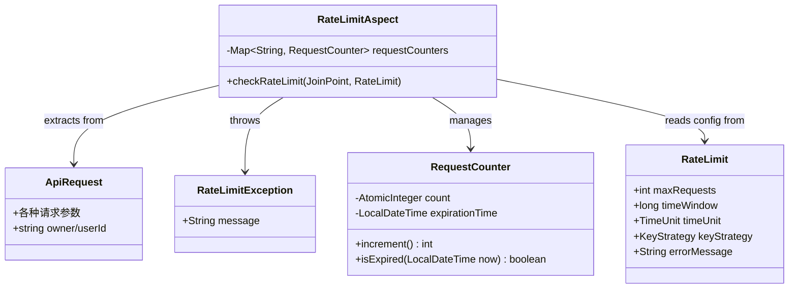

## 需求
在没有使用 redis 的情况下为接口添加频率限制功能，同一用户相同的请求在指定时间窗口内最多只能发起有限次数，超过次数将返回错误。

## 业务模型

## 解决方案
1. 采用AOP方式实现频率限制:
    - 创建自定义`@RateLimit`注解，支持配置限流参数
    - 实现AOP切面拦截带有`@RateLimit`注解的方法
    - 使注解方式与业务逻辑解耦，提高代码可维护性

2. 自定义注解设计:
    - 支持配置最大请求次数、时间窗口大小及单位
    - 支持配置限流键生成策略（基于用户和内容或仅基于用户）
    - 支持自定义错误消息

3. 灵活的限流键生成:
    - 支持两种限流键生成策略：USER_CONTENT（基于用户+内容）和USER（仅基于用户）
    - 默认使用USER_CONTENT策略，实现同一用户相同内容请求的限流

4. 计数器管理:
    - 使用线程安全的ConcurrentHashMap存储计数器
    - 为每个唯一请求哈希维护一个计数器对象
    - 实现自动过期和清理机制

## 结构

### 继承关系
1. RateLimitAspect实现AOP切面，负责拦截带有@RateLimit注解的方法
2. RateLimitException继承自RuntimeException

### 依赖关系
1. RateLimitAspect依赖于@RateLimit注解
2. 业务服务实现类的方法使用@RateLimit注解

## 任务

### 创建RateLimit注解
1. 属性:
    - maxRequests: int - 最大请求次数，可设置默认值
    - timeWindow: long - 时间窗口值，可设置默认值
    - timeUnit: TimeUnit - 时间窗口单位，默认MINUTES
    - keyStrategy: KeyStrategy - 限流键生成策略，默认USER_CONTENT
    - errorMessage: String - 错误消息，有默认值
2. 元注解:
    - @Target(ElementType.METHOD) - 只能应用于方法
    - @Retention(RetentionPolicy.RUNTIME) - 运行时保留
3. 嵌套枚举KeyStrategy:
    - USER_CONTENT - 基于用户和请求内容生成限流键
    - USER - 仅基于用户生成限流键

### 创建RateLimitException类
1. 属性:
    - message: String
2. 构造函数:
    - 使用注解@ResponseStatus(HttpStatus.TOO_MANY_REQUESTS)
    - 调用父类构造函数super(message)

### 创建RateLimitAspect切面类
1. 注解:
    - @Aspect - 标记为切面
    - @Component - 注册为Spring组件
2. 属性:
    - requestCounters: ConcurrentHashMap<String, RequestCounter>
3. 方法:
    - checkRateLimit(JoinPoint joinPoint, RateLimit rateLimit): void
        - 使用@Before("@annotation(rateLimit)")拦截带有@RateLimit注解的方法
        - 从方法参数中提取请求对象
        - 根据策略计算请求哈希值
        - 获取或创建计数器并增加计数
        - 如果超过限制，抛出RateLimitException
4. 辅助方法:
    - findRequestParam(JoinPoint joinPoint): Object
    - calculateRequestHash(Object request, KeyStrategy keyStrategy): String
    - cleanupExpiredCounters(LocalDateTime now): void
5. 内部类RequestCounter:
    - 属性:
        - count: AtomicInteger
        - expirationTime: LocalDateTime
    - 方法:
        - increment(): int
        - isExpired(LocalDateTime now): boolean

### 修改业务服务实现类
1. 在目标方法上添加@RateLimit注解:
    - 设置最大请求次数
    - 设置时间窗口
    - 设置自定义错误消息
    - 选择适当的限流键策略

### 修改GlobalExceptionHandler类
1. 添加方法: handleRateLimitException(RateLimitException ex)
    - 注解:
        - @ExceptionHandler(RateLimitException.class)
        - @ResponseStatus(HttpStatus.TOO_MANY_REQUESTS)
        - @ResponseBody
    - 返回类型: Map<String, Object>
    - 逻辑:
        - 创建包含错误状态和消息的Map
        - 返回Map

## 公共任务
1. 添加spring-boot-starter-aop依赖
2. 所有切面类应使用@Aspect和@Component注解
3. 所有异常类应使用@ResponseStatus注解指定HTTP状态码
4. 使用线程安全的集合和原子类确保并发安全

## 约束条件
- 限制同一用户相同请求在指定时间窗口内的最大请求次数
- 超过限制时返回429 Too Many Requests状态码
- 错误消息应清晰说明限制原因和条件
- 使用AOP实现，与业务逻辑解耦
- 支持灵活配置限流参数 