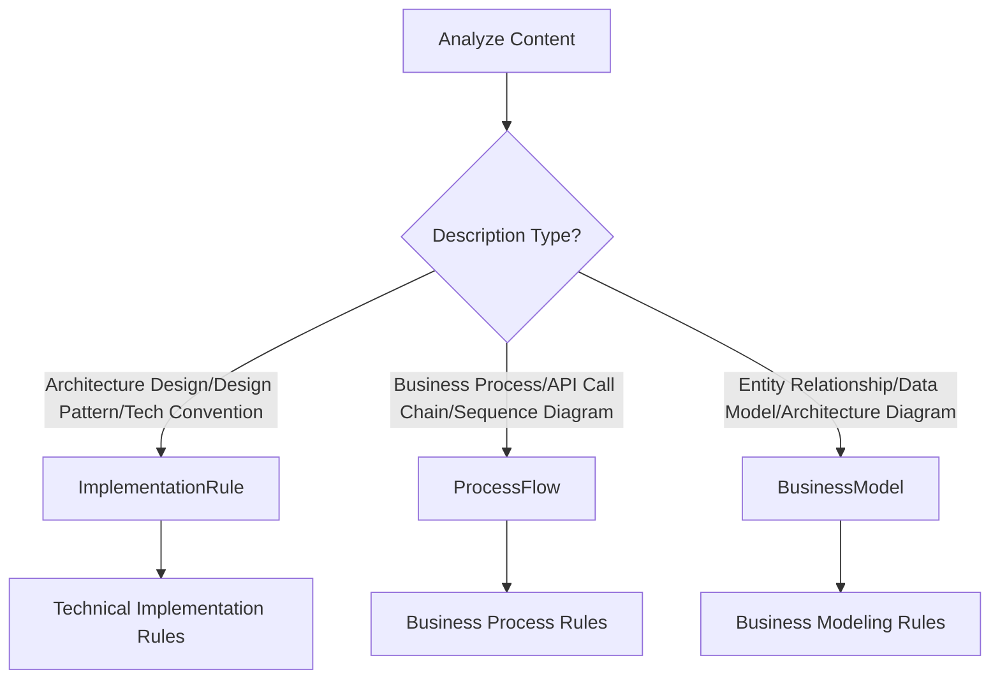
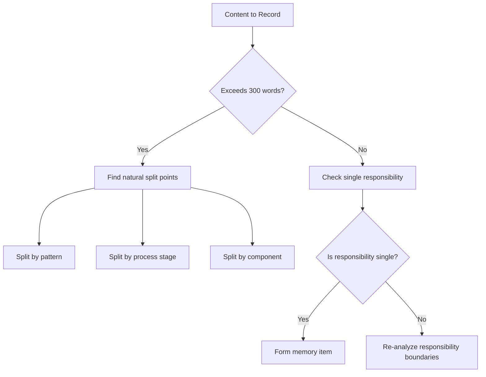
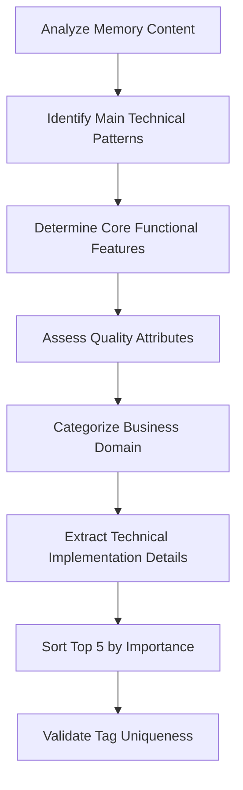
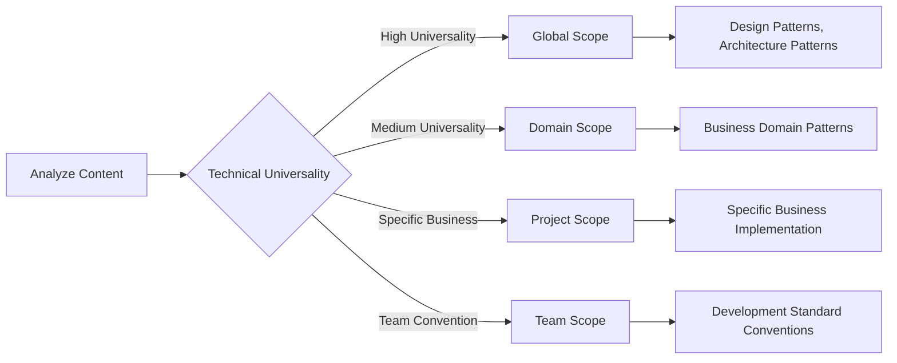
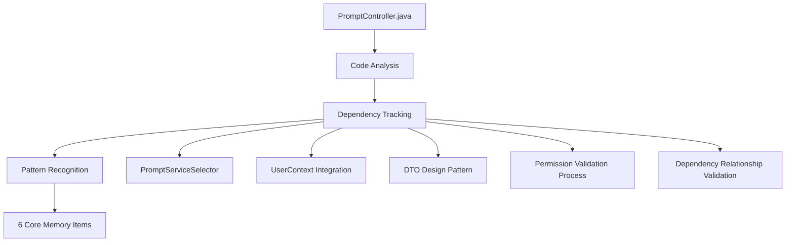
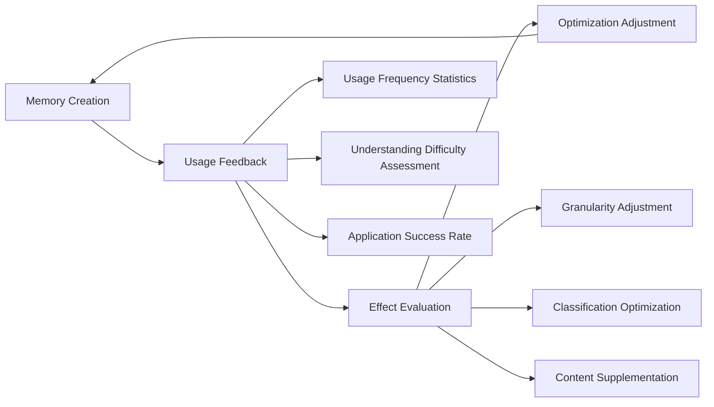

# Memory Generation Strategy Framework

## Overview

This document describes a systematic memory generation strategy for decomposing complex software systems into understandable, reusable, and maintainable knowledge units. Through three-dimensional classification standards and structured descriptions, it builds the team's technical knowledge assets.

---

## 1. Holistic Analysis Phase

### Code Deep Exploration

#### Static Analysis
- **Target File Parsing**: Read class structures, method signatures, annotation information
- **Interface Identification**: Understand externally exposed APIs and internal interfaces
- **Data Flow Analysis**: Trace complete path from request entry to response

#### Dependency Tracking
```
Target File → codebase_search → Related Component Discovery
    ↓
Dependency Graph Construction → Design Pattern Recognition → Architecture Pattern Extraction
```

- **Upward Tracking**: Callers, users, integration points
- **Downward Tracking**: Dependent services, data layer, external systems
- **Horizontal Association**: Same-layer components, collaboration relationships, data transfer

#### Association Mining
- **Design Pattern Discovery**: Strategy, Factory, Observer, etc.
- **Architecture Pattern Recognition**: MVC, layered architecture, microservice patterns
- **Integration Pattern Analysis**: API Gateway, event-driven, message queues

### Architecture Pattern Recognition Matrix

| Pattern Type                  | Recognition Markers                                    | Example                        |
|-------------------------------|--------------------------------------------------------|--------------------------------|
| **Unified Interface Pattern** | Single controller handling multiple resource types     | PromptController               |
| **Service Selector Pattern**  | Select specific implementation based on type/condition | PromptServiceSelector          |
| **Factory Pattern**           | Create different objects based on parameters           | PromptCreateRequest.toPrompt() |
| **Dependency Injection**      | @Autowired annotations and constructor injection       | Various Service components     |
| **Audit Pattern**             | Change records and log tracking                        | ChangeLog system               |
| **...**                       | ...                                                    | ...                            |

---

## 2. 3D Classification Mapping

### Memory Type Decision Logic



### Resource Type Recognition Strategy

#### Entity
- **Recognition Markers**: Core business objects, domain models, data entities
- **Examples**: Rule, Solution, Workflow, User
- **Characteristics**: Clear business meaning and lifecycle

#### Process
- **Recognition Markers**: Business operations, workflows, state transitions
- **Examples**: Creation process, update process, approval process
- **Characteristics**: Describes business behaviors and operation sequences

#### Integration
- **Recognition Markers**: External interfaces, API design, inter-system interactions
- **Examples**: REST API, message queues, third-party integrations
- **Characteristics**: Involves system boundaries and external communication

#### Configuration
- **Recognition Markers**: System configuration, rule definitions, policy settings
- **Examples**: ID prefix strategy, routing rules, permission configuration
- **Characteristics**: Parameters and rules affecting system behavior

#### Infrastructure
- **Recognition Markers**: Technical foundation components, platform services, operational tools
- **Examples**: Database connections, caching, monitoring
- **Characteristics**: Technical facilities supporting business operations

### Operation Type Classification Standards

#### ProcessFlow Operations
- **Create**: Resource creation process
- **Update**: Resource update process
- **Query**: Query and retrieval operations
- **Delete**: Deletion and cleanup operations
- **Batch**: Batch processing operations
- **Search**: Search and filtering operations

#### ImplementationRule Patterns
- **UnifiedManagement**: Unified management pattern
- **Performance**: Performance optimization pattern
- **Security**: Security control pattern
- **Pattern**: Generic design patterns

#### BusinessModel Modeling
- **EntityRelation**: Entity relationship modeling
- **DataModel**: Data model design
- **Architecture**: Architecture design modeling
- **Integration**: Integration pattern modeling

---

## 3. Granularity Control Strategy

### Single Responsibility Principle

#### Good Memory Item Examples
```markdown
Title: Service Selector Pattern for Multi-Type Resource Management
Content: Focus on service selection and routing mechanism
Scope: Complete implementation of single design pattern
```

#### Memory Items to Avoid
```markdown
Title: All Functions of PromptController
Problem: Scope too broad, lacks focus
Suggestion: Split into multiple specific patterns and processes
```

### Memory Size Control Standards

| Dimension | Standard | Description |
|-----------|----------|-------------|
| **Minimum Unit** | One complete technical pattern or business process | Ensure memory completeness |
| **Maximum Scope** | No more than one subsystem's core responsibilities | Avoid information overload |
| **Target Length** | 150-300 words, containing 8-10 key points | Balance detail and readability |
| **Complexity** | Understandable by medium technical background | Ensure team members can apply |

### Split Decision Tree



---

## 4. Metadata Field Generation Strategy

### Project Field Generation Rules

#### Naming Convention
- **Format**: Use lowercase letters and hyphens in kebab-case format
- **Structure**: [domain]-[system/module]-[type]
- **Examples**: `workflow-management-system`, `user-authentication-service`

#### Project Identification Strategy
```markdown
Technical Domain Classification:
- workflow-management-system: Workflow management related
- prompt-management-system: Prompt management related  
- user-authentication-service: User authentication related
- api-gateway-service: API gateway related
- data-processing-pipeline: Data processing pipeline related
```

### Tag Field Generation Strategy

#### Tag Quantity Standards
- **Fixed Quantity**: Each memory item must contain exactly 5 tags
- **Priority**: Sorted by importance and relevance
- **Uniqueness**: Avoid duplicate or overly similar tags

#### Tag Classification System
```markdown
1. **Technical Pattern Tags**
   - REST-API, Service-Selector, DTO-Pattern, Query-Builder
   - Multi-Type-Management, Unified-API, ID-Prefix-Strategy
   
2. **Functional Feature Tags**
   - CRUD-Operations, Batch-Processing, Step-Validation
   - User-Context, Auto-Fill, Permission-Management
   
3. **Quality Attribute Tags**
   - Performance-Optimization, Security-Enforcement, Thread-Safe
   - Error-Handling, Exception-Handling, Input-Validation
   
4. **Business Domain Tags**
   - Business-Process, Workflow-Integration, Resource-Lifecycle
   - Cross-Type-Validation, Dependency-Validation, Change-Logging
   
5. **Technical Implementation Tags**
   - Parallel-Processing, Type-Abstraction, Factory-Methods
   - HTTP-Status-Codes, Service-Delegation, Referential-Integrity
```

#### Tag Selection Algorithm


### Importance Field Scoring Strategy

#### Scoring Standard System
```markdown
10 points (Extremely High Importance) - Critical
- Core business processes, essential system functions
- Core design decisions affecting overall system architecture
- Security-critical components or data integrity mechanisms

9 points (High Importance) - High  
- Important architecture patterns affecting overall system design
- Key security mechanisms and user management functions
- Core API design and unified management patterns

8 points (Medium-High Importance) - Medium-High
- Important technical implementations affecting system performance and maintainability  
- Key integration patterns and service coordination mechanisms
- Important exception handling and error recovery strategies

7 points (Medium Importance) - Medium
- Standard technical practices improving code quality and development efficiency
- Performance optimization and query building support functions
- Data transformation and DTO design patterns

6 points (Medium-Low Importance) - Medium-Low
- Auxiliary functions providing convenience but not core necessities
- Specific scenario search and retrieval functions
- Standardized response formats and data mapping

5 points and below (Low Importance) - Low
- Utility functions, replaceable or optional implementations
- Edge case handling and compatibility functions
- Configuration functions and customizable options
```

#### Importance Assessment Matrix

| Dimension | Weight | Assessment Criteria |
|-----------|--------|-------------------|
| **Business Criticality** | 40% | Impact level on core business processes |
| **Technical Complexity** | 25% | Implementation complexity and technical difficulty |
| **Reuse Value** | 20% | Application potential in other projects |
| **Maintenance Cost** | 10% | Long-term maintenance and update difficulty |
| **Innovation Level** | 5% | Innovation and advancement of technical solution |

#### Scoring Decision Process


---

## 5. Content Structuring Strategy

### Standard Description Template

```markdown
### [Memory Item Title]
**Memory ID**: [System Prefix]_[Classification Abbreviation]_[Serial Number]  
**Classification**: [MemoryType] - [ResourceType] - [OperationType]  
**Scope**: [Global/Project/Team]  
**Project**: [project-identifier]  
**Tags**: [Tag1], [Tag2], [Tag3], [Tag4], [Tag5]  
**Importance**: [1-10]/10

[System/Component] implements [Pattern Name] for [Target Purpose]:

1) **Core Mechanism**: Describe main working principles and key components
2) **Implementation Method**: Explain specific technical implementation approaches
3) **Workflow**: Overview main operation steps and data flow
4) **Error Handling**: Describe exception handling strategies
5) **Integration Interface**: Explain collaboration with other components
6) **Extensibility**: Describe system extensibility design
7) **Performance Considerations**: Related performance optimizations and limitations
8) **Security Control**: Related security mechanisms and permission control
```

### Association Modeling Strategy

#### Vertical Association (Abstraction Levels)
```
Interface Layer (Controller) 
    ↓
Business Layer (Service)
    ↓  
Data Layer (Repository)
    ↓
Entity Layer (Entity)
```

#### Horizontal Association (Same Layer Components)
```
Controller ←→ Filter ←→ Exception Handler
Service ←→ Validator ←→ Event Publisher
Repository ←→ Cache ←→ Message Queue
```

#### Sequential Association (Business Process)
```
Request Validation → Permission Check → Business Processing → Data Persistence → Response Return
```

### Content Quality Standards

| Quality Dimension | Assessment Criteria | Checkpoints |
|------------------|-------------------|-------------|
| **Accuracy** | Technical descriptions error-free, code references correct | Code validation, technical review |
| **Completeness** | Covers key processes and components | Process check, component checklist |
| **Clarity** | Clear logic, easy to understand | Readability test, terminology consistency |
| **Practicality** | Can guide actual development work | Use cases, example code |

---

## 6. Scope Assessment Algorithm

### Scope Assessment Matrix



### Global Level Assessment Criteria
- **Technical Patterns**: Design patterns reusable across multiple projects
- **Architecture Components**: Universal architecture design and implementation methods
- **Utility Methods**: Independent utility classes and helper methods
- **Standard Protocols**: Universal interface and protocol definitions

#### Examples
```markdown
Global: Service Selector Pattern
- Applicable to any scenario requiring type routing
   
Global: Unified DTO Pattern  
- Suitable for multi-type resource API design
   
Global: ID Prefix Strategy
- Universal resource identification and classification method
```

### Project Level Assessment Criteria
- **Business Logic**: Project-specific business rules and processes
- **Data Models**: Project-specific entity relationships and constraints
- **Integration Implementation**: Specific external system integration methods
- **Permission Models**: Project-specific permission design

#### Examples
```markdown
Project: PromptController Business Process
- Specific to current project's Rule/Solution management
   
Project: User Permission Integration
- UserContext-based permission implementation
   
Project: Workflow Dependency Validation
- Specific business rules and constraint checking
```

---

## 7. Quality Assurance Mechanism

### Completeness Check Checklist

#### Technical Coverage Dimensions
- [ ] **Architecture Level**: Overall design concepts and patterns
- [ ] **Design Patterns**: Specific technical implementation patterns
- [ ] **Integration Interfaces**: Component collaboration methods
- [ ] **Data Flow**: Information flow within the system

#### Business Coverage Dimensions
- [ ] **CRUD Operations**: Create, read, update, delete processes
- [ ] **Permission Control**: Authentication, authorization, permission validation
- [ ] **Data Integrity**: Constraint checking, dependency validation
- [ ] **Audit Tracking**: Operation records, change logs

#### Layer Coverage Dimensions
- [ ] **Presentation Layer**: Controller, API interface design
- [ ] **Business Layer**: Service, business logic implementation
- [ ] **Data Layer**: Repository, data access patterns
- [ ] **Model Layer**: Entity, DTO, data structures

### Consistency Validation Standards

#### Naming Consistency
```markdown
Unified Terminology Usage
- "PromptController" vs "Prompt Controller" 
- Choose one and maintain consistency

Consistent Concept Definitions
- "Service Selector" definition consistent across all memories
- Avoid different expressions of the same concept
```

#### Classification Consistency
```markdown
Similar Patterns Use Same Classification
- All "XXX Selector Pattern" classified as ImplementationRule-Configuration-Pattern
- All "XXX Business Process" classified as ProcessFlow-Process-ProcessFlow
```

#### Granularity Consistency
```markdown
Similar Complexity Memories Maintain Similar Length
- Design pattern memories: 200-250 words
- Business process memories: 250-300 words
- Simple configuration memories: 150-200 words
```

#### Metadata Consistency
```markdown
Project Field Consistency
- Memories from same system use same project identifier
- Follow kebab-case naming convention
- Project identifier matches actual system name

Tag Standardization
- Each memory item has exactly 5 tags
- Use tags from standard tag classification system
- Tags sorted by importance and relevance
- Avoid semantically duplicate tags

Importance Score Consistency
- Similar functional complexity memories use similar scores
- Core business processes scored 8-10 points
- Support functions scored 6-7 points
- Utility functions scored 5 points or below
```

---

## 8. Practical Application Case Analysis

### Complete PromptController Case Breakdown

#### Discovery Process


#### Memory Item Mapping

| Memory Item | Classification | Scope | Project | Importance | Tag Examples |
|-------------|---------------|--------|---------|------------|--------------|
| **Unified Management Pattern** | ImplementationRule-Entity-UnifiedManagement | Project | workflow-management-system | 9/10 | Unified-API, Multi-Type-Management, CRUD-Operations, Service-Selector, ID-Prefix-Strategy |
| **Business Process** | ProcessFlow-Process-ProcessFlow | Project | workflow-management-system | 10/10 | Business-Process, Resource-Lifecycle, Multi-Type-Operations, Type-Routing, Change-Logging |
| **Service Selector** | ImplementationRule-Configuration-Pattern | Global | workflow-management-system | 9/10 | Service-Selector, Type-Routing, Batch-Processing, ID-Prefix-Inference, Pattern-Extensibility |
| **User Context** | ImplementationRule-Process-Security | Project | workflow-management-system | 9/10 | User-Context, Permission-Management, Auto-Population, Thread-Safe, Security-Validation |
| **DTO Design** | ImplementationRule-Integration-Pattern | Global | workflow-management-system | 8/10 | DTO-Pattern, Multi-Type-Response, Polymorphic-Factory, Type-Metadata, Auto-Population |
| **Dependency Validation** | ProcessFlow-Process-ProcessFlow | Project | workflow-management-system | 10/10 | Dependency-Validation, Cross-Type-Validation, Referential-Integrity, Workflow-Integration, Pre-Deletion-Check |

#### Granularity Control Example

**Good Granularity Control**
```markdown
Memory: Service Selector Pattern
Content: Focus on type routing mechanism
- Type mapping logic
- ID prefix inference  
- Batch processing optimization
- Error handling strategy
Length: 238 words, 8 key points
```

**Granularity Needing Optimization**
```markdown
Original Idea: Complete PromptController functionality
Problem: Content too broad
Optimization: Split into 6 independent memory items
Result: Each memory focuses on single responsibility
```

---

## 9. Continuous Optimization Strategy

### Iterative Improvement Process



### Feedback Collection Mechanism

#### Usage Effect Indicators
- **Search Efficiency**: Can relevant memories be found quickly
- **Understanding Speed**: Learning time for new team members
- **Application Success Rate**: Success rate of implementing functions based on memories
- **Reuse Rate**: Memory reuse in different scenarios

#### Optimization Trigger Conditions
- Memory usage frequency below expectations
- Team member feedback about understanding difficulties
- Discovery of better classification methods
- Technology stack upgrades requiring updates

### Pattern Extraction and Upgrade

#### Project → Global Upgrade Criteria
```markdown
Condition Check:
1. Similar implementations appear in multiple projects
2. Technical pattern has universality
3. Team believes it has promotion value
4. Has been validated through practice

Upgrade Process:
1. Abstract universal pattern
2. Remove project-specific details  
3. Add applicable scenario descriptions
4. Update classification and scope
```

### Tool-Assisted Strategy

#### Automated Detection
- **Code Similarity Analysis**: Discover duplicate implementation patterns
- **Dependency Relationship Tracking**: Update inter-component associations
- **Change Impact Analysis**: Impact of code changes on memories

#### Memory Management Tools
- **Classification Statistics**: Memory quantity distribution by dimensions
- **Association Graph**: Reference relationships between memories
- **Usage Heat Map**: Memory access frequency analysis

---

## Core Philosophy and Value

### Design Philosophy
> **Decompose complex software systems into understandable, reusable, and maintainable knowledge units**

### Value Realization
1. **Knowledge Asset Creation**: Make tacit knowledge explicit, accumulate team wisdom
2. **Learning Acceleration**: New members quickly understand system architecture and design concepts
3. **Decision Support**: Provide references for technology selection and architecture design
4. **Quality Assurance**: Improve code quality and consistency through pattern reuse
5. **Innovation Promotion**: Improve and innovate based on existing patterns

### Implementation Recommendations
1. **Gradual Progress**: Start from core modules, gradually cover the entire system
2. **Team Collaboration**: Encourage team members to contribute and improve memory items
3. **Continuous Maintenance**: Regularly review and update memory content
4. **Tool Support**: Develop or select appropriate memory management tools
5. **Culture Building**: Foster a team culture of knowledge sharing and learning

---

**Document Version**: v2.0  
**Last Updated**: 2025-07-31  
**Applicable Scope**: Software development team knowledge management  
**Maintenance Team**: Technical Architecture Group  
**Major Updates**: Added metadata field generation strategy (project, tags, importance)