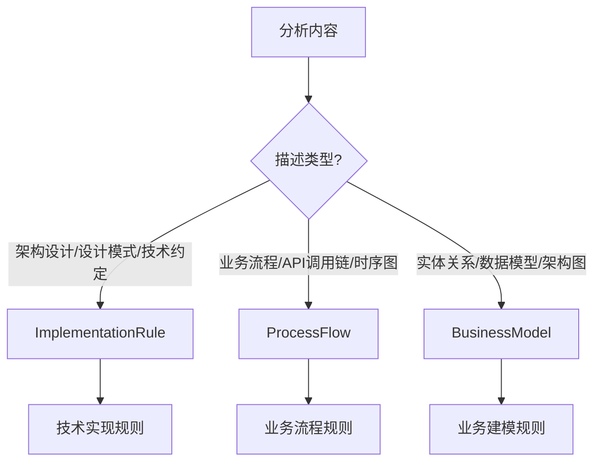
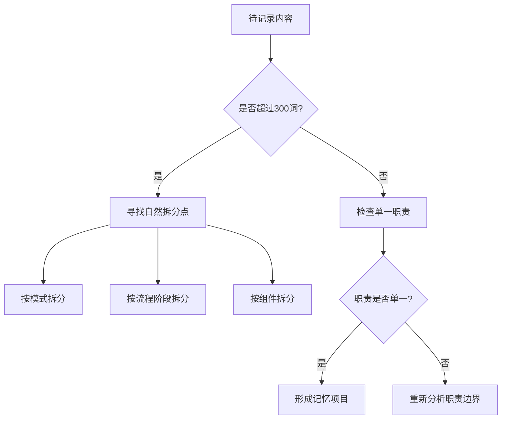
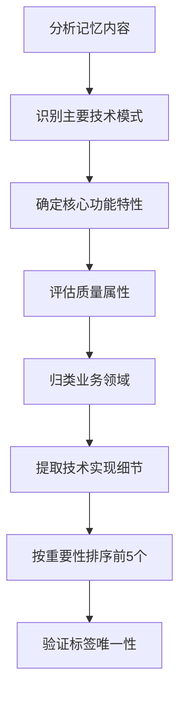
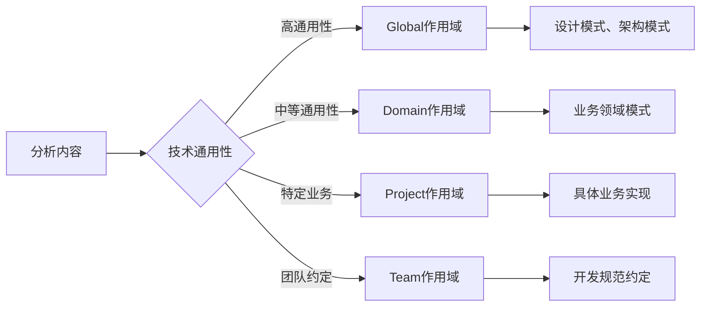
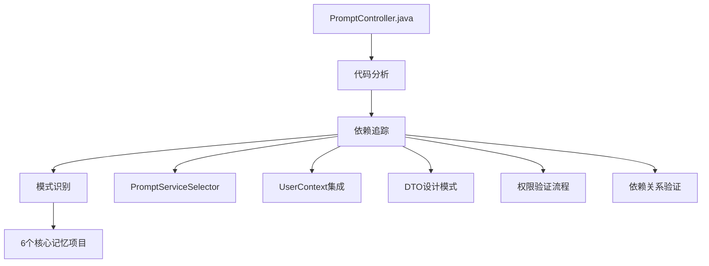
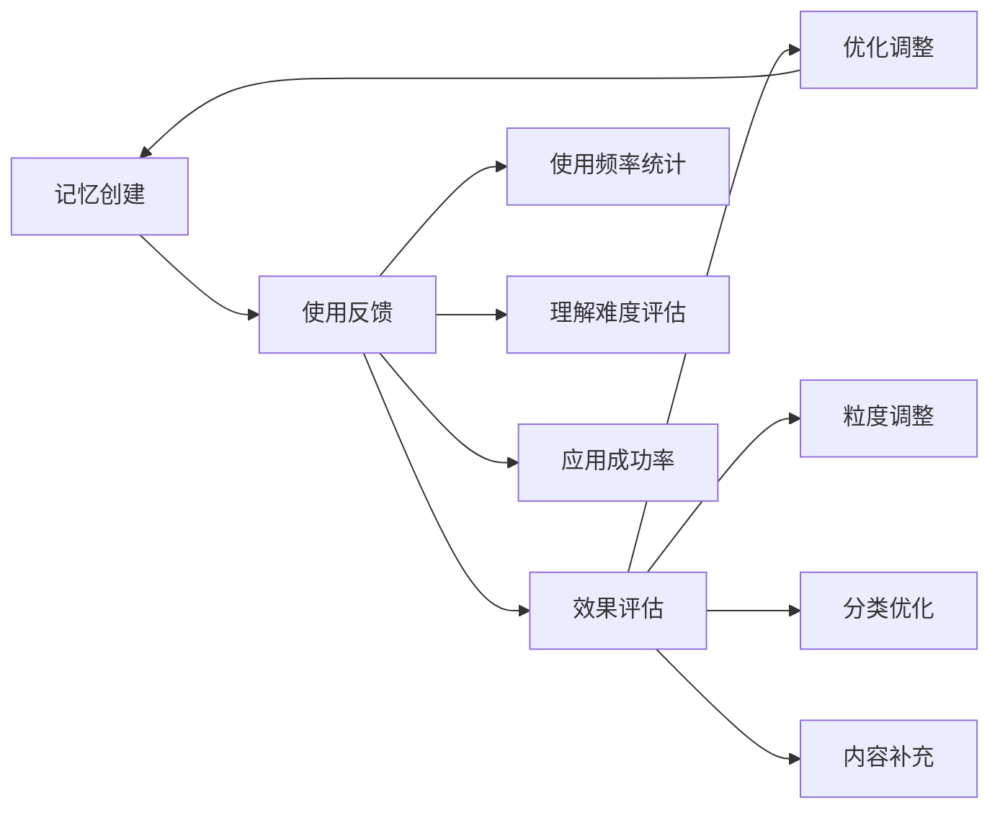

# 记忆项目生成策略框架 (Memory Generation Strategy Framework)

## 概述

本文档描述了一套系统化的记忆项目生成策略，用于将复杂的软件系统分解为可理解、可复用、可维护的知识单元。通过三维分类标准和结构化描述，构建团队的技术知识资产。

---

## 🎯 1. 全景分析阶段 (Holistic Analysis)

### 📊 代码深度探索

#### 静态分析
- **目标文件解析**：读取类结构、方法签名、注解信息
- **接口识别**：理解对外暴露的API和内部接口
- **数据流分析**：追踪请求从入口到响应的完整路径

#### 依赖追踪
```
目标文件 → codebase_search → 相关组件发现
    ↓
依赖图构建 → 设计模式识别 → 架构模式提取
```

- **向上追踪**：调用者、使用者、集成点
- **向下追踪**：依赖服务、数据层、外部系统
- **横向关联**：同层组件、协作关系、数据传递

#### 关联挖掘
- **设计模式发现**：Strategy, Factory, Observer等
- **架构模式识别**：MVC, 分层架构, 微服务模式
- **集成模式分析**：API Gateway, 事件驱动, 消息队列

### 🔍 架构模式识别矩阵

| 模式类型 | 识别标志 | 示例 |
|---------|---------|-----|
| **统一接口模式** | 单一控制器处理多类型资源 | PromptController |
| **服务选择器模式** | 基于类型/条件选择具体实现 | PromptServiceSelector |
| **工厂模式** | 基于参数创建不同对象 | PromptCreateRequest.toPrompt() |
| **依赖注入** | @Autowired注解和构造函数注入 | 各Service组件 |
| **审计模式** | 变更记录和日志追踪 | ChangeLog系统 |

---

## 📋 2. 三维分类映射 (3D Classification Mapping)

### 记忆类型判断逻辑



### 资源类型识别策略

#### Entity (实体类)
- **识别标志**：核心业务对象、领域模型、数据实体
- **示例**：Rule, Solution, Workflow, User
- **特征**：有明确的业务含义和生命周期

#### Process (流程类)
- **识别标志**：业务操作、工作流程、状态变迁
- **示例**：创建流程、更新流程、审批流程
- **特征**：描述业务行为和操作序列

#### Integration (集成类)
- **识别标志**：外部接口、API设计、系统间交互
- **示例**：REST API、消息队列、第三方集成
- **特征**：涉及系统边界和外部通信

#### Configuration (配置类)
- **识别标志**：系统配置、规则定义、策略设置
- **示例**：ID前缀策略、路由规则、权限配置
- **特征**：影响系统行为的参数和规则

#### Infrastructure (基础设施类)
- **识别标志**：技术基础组件、平台服务、运维工具
- **示例**：数据库连接、缓存、监控
- **特征**：支撑业务运行的技术设施

### 操作类型分类标准

#### ProcessFlow 操作
- **Create**: 资源创建流程
- **Update**: 资源更新流程
- **Query**: 查询和检索操作
- **Delete**: 删除和清理操作
- **Batch**: 批量处理操作
- **Search**: 搜索和过滤操作

#### ImplementationRule 模式
- **UnifiedManagement**: 统一管理模式
- **Performance**: 性能优化模式
- **Security**: 安全控制模式
- **Pattern**: 通用设计模式

#### BusinessModel 建模
- **EntityRelation**: 实体关系建模
- **DataModel**: 数据模型设计
- **Architecture**: 架构设计建模
- **Integration**: 集成模式建模

---

## 🎨 3. 粒度控制策略 (Granularity Control)

### 单一职责原则

#### ✅ 好的记忆项目示例
```markdown
标题：Service Selector Pattern for Multi-Type Resource Management
内容：专注于服务选择和路由机制
范围：单一设计模式的完整实现
```

#### ❌ 避免的记忆项目示例
```markdown
标题：PromptController的所有功能
问题：范围过于宽泛，缺乏聚焦
建议：拆分为多个具体的模式和流程
```

### 记忆大小控制标准

| 维度 | 标准 | 说明 |
|-----|------|-----|
| **最小单位** | 一个完整的技术模式或业务流程 | 保证记忆的完整性 |
| **最大范围** | 不超过一个子系统的核心职责 | 避免信息过载 |
| **目标长度** | 150-300词，包含8-10个关键点 | 平衡详细程度和可读性 |
| **复杂度** | 中等技术背景可理解 | 确保团队成员能够应用 |

### 拆分决策树



---

## 🏷️ 4. 元数据字段生成策略 (Metadata Field Generation)

### 项目字段生成规则

#### 命名约定
- **格式**: 使用小写字母和连字符的kebab-case格式
- **结构**: [domain]-[system/module]-[type]
- **示例**: `workflow-management-system`, `user-authentication-service`

#### 项目标识策略
```markdown
技术领域分类：
- workflow-management-system: 工作流管理相关
- prompt-management-system: 提示词管理相关  
- user-authentication-service: 用户认证相关
- api-gateway-service: API网关相关
- data-processing-pipeline: 数据处理流水线相关
```

### 标签字段生成策略

#### 标签数量标准
- **固定数量**: 每个记忆项目必须包含5个标签
- **优先级**: 按重要性和相关性排序
- **唯一性**: 避免重复或过于相似的标签

#### 标签分类体系
```markdown
1. **技术模式标签** (Technical Pattern)
   - REST-API, Service-Selector, DTO-Pattern, Query-Builder
   - Multi-Type-Management, Unified-API, ID-Prefix-Strategy
   
2. **功能特性标签** (Functional Feature)  
   - CRUD-Operations, Batch-Processing, Step-Validation
   - User-Context, Auto-Fill, Permission-Management
   
3. **质量属性标签** (Quality Attribute)
   - Performance-Optimization, Security-Enforcement, Thread-Safe
   - Error-Handling, Exception-Handling, Input-Validation
   
4. **业务领域标签** (Business Domain)
   - Business-Process, Workflow-Integration, Resource-Lifecycle
   - Cross-Type-Validation, Dependency-Validation, Change-Logging
   
5. **技术实现标签** (Technical Implementation)
   - Parallel-Processing, Type-Abstraction, Factory-Methods
   - HTTP-Status-Codes, Service-Delegation, Referential-Integrity
```

#### 标签选择算法


### 重要性字段评分策略

#### 评分标准体系
```markdown
10分 (极高重要性) - Critical
- 核心业务流程，系统不可缺少的关键功能
- 影响系统整体架构的核心设计决策
- 安全关键组件或数据完整性保障机制

9分 (高重要性) - High  
- 重要架构模式，影响系统整体设计
- 关键的安全机制和用户管理功能
- 核心的API设计和统一管理模式

8分 (较高重要性) - Medium-High
- 重要的技术实现，影响系统性能和可维护性  
- 关键的集成模式和服务协调机制
- 重要的异常处理和错误恢复策略

7分 (中等重要性) - Medium
- 标准的技术实践，有助于代码质量和开发效率
- 性能优化和查询构建等支撑功能
- 数据转换和DTO设计模式

6分 (一般重要性) - Medium-Low
- 辅助功能，提供便利性但非核心必需
- 特定场景的查找和检索功能
- 标准化的响应格式和数据映射

5分及以下 (低重要性) - Low
- 工具性功能，可替代或可选的实现
- 边缘案例处理和兼容性功能
- 配置性功能和可定制选项
```

#### 重要性评估矩阵

| 维度 | 权重 | 评估标准 |
|------|------|----------|
| **业务关键性** | 40% | 对核心业务流程的影响程度 |
| **技术复杂性** | 25% | 实现复杂度和技术难度 |
| **复用价值** | 20% | 在其他项目中的应用潜力 |
| **维护成本** | 10% | 长期维护和更新的难度 |
| **创新程度** | 5% | 技术方案的创新性和先进性 |

#### 评分决策流程


---

## 📝 5. 内容结构化策略 (Content Structuring)

### 标准描述模板

```markdown
### [记忆项目标题]
**记忆ID**: [系统前缀]_[分类简写]_[序号]  
**分类**: [MemoryType] - [ResourceType] - [OperationType]  
**作用域**: [Global/Project/Team]  
**项目**: [project-identifier]  
**标签**: [Tag1], [Tag2], [Tag3], [Tag4], [Tag5]  
**重要性**: [1-10]/10

[系统/组件] implements [模式名称] for [目标用途]:

1) **核心机制**: 描述主要的工作原理和关键组件
2) **实现方式**: 说明具体的技术实现方法
3) **工作流程**: 概述主要的操作步骤和数据流
4) **错误处理**: 描述异常情况的处理策略
5) **集成接口**: 说明与其他组件的协作方式
6) **扩展性**: 描述系统的可扩展性设计
7) **性能考虑**: 涉及的性能优化和限制
8) **安全控制**: 相关的安全机制和权限控制
```

### 关联性建模策略

#### 垂直关联 (抽象层次)
```
接口层(Controller) 
    ↓
业务层(Service)
    ↓  
数据层(Repository)
    ↓
实体层(Entity)
```

#### 水平关联 (同层组件)
```
Controller ←→ Filter ←→ Exception Handler
Service ←→ Validator ←→ Event Publisher
Repository ←→ Cache ←→ Message Queue
```

#### 时序关联 (业务流程)
```
请求验证 → 权限检查 → 业务处理 → 数据持久化 → 响应返回
```

### 内容质量标准

| 质量维度 | 评估标准 | 检查点 |
|---------|---------|--------|
| **准确性** | 技术描述无误，代码引用正确 | 代码验证、技术审查 |
| **完整性** | 覆盖关键流程和组件 | 流程检查、组件清单 |
| **清晰性** | 逻辑清楚，易于理解 | 可读性测试、术语一致 |
| **实用性** | 可指导实际开发工作 | 应用场景、示例代码 |

---

## 🌐 6. 作用域判断算法 (Scope Assessment)

### 作用域判断矩阵



### Global级别判断标准
- **技术模式**：可在多项目复用的设计模式
- **架构组件**：通用的架构设计和实现方式
- **工具方法**：独立的工具类和辅助方法
- **标准协议**：通用的接口和协议定义

#### 示例
```markdown
✅ Global: Service Selector Pattern
   - 可用于任何需要类型路由的场景
   
✅ Global: Unified DTO Pattern  
   - 适用于多类型资源的API设计
   
✅ Global: ID Prefix Strategy
   - 通用的资源标识和分类方法
```

### Project级别判断标准
- **业务逻辑**：特定项目的业务规则和流程
- **数据模型**：项目特有的实体关系和约束
- **集成实现**：具体的外部系统集成方式
- **权限模型**：项目特定的权限设计

#### 示例
```markdown
✅ Project: PromptController业务流程
   - 特定于当前项目的Rule/Solution管理
   
✅ Project: 用户权限集成
   - 基于UserContext的权限实现
   
✅ Project: 工作流依赖验证
   - 特定的业务规则和约束检查
```

---

## ✅ 7. 质量保证机制 (Quality Assurance)

### 完整性检查清单

#### 技术覆盖维度
- [ ] **架构层面**：整体设计思路和模式
- [ ] **设计模式**：具体的技术实现模式
- [ ] **集成接口**：组件间的协作方式
- [ ] **数据流转**：信息在系统中的流动

#### 业务覆盖维度
- [ ] **CRUD操作**：创建、读取、更新、删除流程
- [ ] **权限控制**：认证、授权、权限验证
- [ ] **数据完整性**：约束检查、依赖验证
- [ ] **审计追踪**：操作记录、变更日志

#### 层次覆盖维度
- [ ] **表现层**：Controller、API接口设计
- [ ] **业务层**：Service、业务逻辑实现
- [ ] **数据层**：Repository、数据访问模式
- [ ] **模型层**：Entity、DTO、数据结构

### 一致性验证标准

#### 命名一致性
```markdown
✅ 统一术语使用
   - "PromptController" vs "Prompt Controller" 
   - 选择一种并保持一致

✅ 概念定义一致
   - "Service Selector"的定义在所有记忆中保持一致
   - 避免同一概念的不同表述
```

#### 分类一致性
```markdown
✅ 相似模式使用相同分类
   - 所有"XXX Selector Pattern"归类为ImplementationRule-Configuration-Pattern
   - 所有"XXX业务流程"归类为ProcessFlow-Process-ProcessFlow
```

#### 粒度一致性
```markdown
✅ 相似复杂度的记忆保持类似长度
   - 设计模式类记忆：200-250词
   - 业务流程类记忆：250-300词
   - 简单配置类记忆：150-200词
```

#### 元数据一致性
```markdown
✅ 项目字段一致性
   - 同一系统的记忆使用相同项目标识
   - 遵循kebab-case命名约定
   - 项目标识与实际系统名称匹配

✅ 标签标准化
   - 每个记忆项目恰好5个标签
   - 使用标准标签分类体系中的标签
   - 标签按重要性和相关性排序
   - 避免语义重复的标签

✅ 重要性评分一致性
   - 相似功能复杂度的记忆使用相似评分
   - 核心业务流程评分8-10分
   - 支撑功能评分6-7分
   - 工具性功能评分5分以下
```

---

## 🎯 8. 实际应用示例分析

### PromptController案例完整拆解

#### 发现过程


#### 记忆项目映射

| 记忆项目 | 分类 | 作用域 | 项目 | 重要性 | 标签示例 |
|---------|------|--------|------|--------|----------|
| **统一管理模式** | ImplementationRule-Entity-UnifiedManagement | Project | workflow-management-system | 9/10 | Unified-API, Multi-Type-Management, CRUD-Operations, Service-Selector, ID-Prefix-Strategy |
| **业务流程** | ProcessFlow-Process-ProcessFlow | Project | workflow-management-system | 10/10 | Business-Process, Resource-Lifecycle, Multi-Type-Operations, Type-Routing, Change-Logging |
| **服务选择器** | ImplementationRule-Configuration-Pattern | Global | workflow-management-system | 9/10 | Service-Selector, Type-Routing, Batch-Processing, ID-Prefix-Inference, Pattern-Extensibility |
| **用户上下文** | ImplementationRule-Process-Security | Project | workflow-management-system | 9/10 | User-Context, Permission-Management, Auto-Population, Thread-Safe, Security-Validation |
| **DTO设计** | ImplementationRule-Integration-Pattern | Global | workflow-management-system | 8/10 | DTO-Pattern, Multi-Type-Response, Polymorphic-Factory, Type-Metadata, Auto-Population |
| **依赖验证** | ProcessFlow-Process-ProcessFlow | Project | workflow-management-system | 10/10 | Dependency-Validation, Cross-Type-Validation, Referential-Integrity, Workflow-Integration, Pre-Deletion-Check |

#### 粒度控制实例

**✅ 良好的粒度控制**
```markdown
记忆：Service Selector Pattern
内容：专注于类型路由机制
- 类型映射逻辑
- ID前缀推断  
- 批量处理优化
- 错误处理策略
长度：238词，8个要点
```

**❌ 需要优化的粒度**
```markdown
原始想法：PromptController完整功能
问题：内容过于宽泛
优化：拆分为6个独立的记忆项目
结果：每个记忆聚焦单一职责
```

---

## 📈 9. 持续优化策略

### 迭代改进流程



### 反馈收集机制

#### 使用效果指标
- **查找效率**：能否快速找到相关记忆
- **理解速度**：新团队成员学习时间
- **应用成功率**：基于记忆实现功能的成功率
- **重复利用率**：记忆在不同场景的复用情况

#### 优化触发条件
- 记忆使用频率低于预期
- 团队成员反馈理解困难
- 发现更好的分类方式
- 技术栈升级需要更新

### 模式提取与升级

#### Project → Global 升级标准
```markdown
条件检查：
1. 在多个项目中出现相似实现
2. 技术模式具有通用性
3. 团队认为有推广价值
4. 已经过实践验证

升级流程：
1. 抽象出通用模式
2. 移除项目特定细节  
3. 增加适用场景说明
4. 更新分类和作用域
```

### 工具辅助策略

#### 自动化检测
- **代码相似度分析**：发现重复的实现模式
- **依赖关系追踪**：更新组件间关联关系
- **变更影响分析**：代码变更对记忆的影响

#### 记忆管理工具
- **分类统计**：各维度记忆数量分布
- **关联图谱**：记忆间的引用关系
- **使用热力图**：记忆的访问频率分析

---

## 🎯 核心理念与价值

### 设计哲学
> **将复杂的软件系统分解为可理解、可复用、可维护的知识单元**

### 价值体现
1. **知识资产化**：将隐性知识显性化，积累团队智慧
2. **学习加速**：新成员快速理解系统架构和设计思路
3. **决策支持**：为技术选型和架构设计提供参考
4. **质量保障**：通过模式复用提高代码质量和一致性
5. **创新促进**：基于已有模式进行改进和创新

### 实施建议
1. **循序渐进**：从核心模块开始，逐步覆盖整个系统
2. **团队协作**：鼓励团队成员贡献和完善记忆项目
3. **持续维护**：定期回顾和更新记忆内容
4. **工具支持**：开发或选择合适的记忆管理工具
5. **文化建设**：培养知识分享和学习的团队文化

---

**文档版本**: v2.0  
**最后更新**: 2025-07-31  
**适用范围**: 软件开发团队知识管理  
**维护团队**: 技术架构组  
**主要更新**: 增加元数据字段生成策略（项目、标签、重要性） 