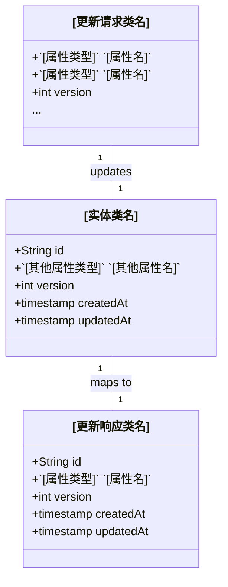

## 需求
实现一个`[实体名称]`API端点，允许用户更新现有的`[实体名称]`。

## 业务模型

## 解决方案
1. API设计:
   - 创建PUT端点 `/api/v1/`[实体名称复数形式]`/{id}` 用于更新现有的`[实体名称]`
   - 创建PATCH端点 `/api/v1/`[实体名称复数形式]`/{id}` 用于部分更新`[实体名称]`
   - 返回适当的HTTP状态码表示成功和错误情况
   - `[特殊处理逻辑，如有]`
   - [数据验证逻辑，如有]

## 结构

### 继承关系
1. [实体类名]Service接口定义[实体类名]服务方法
2. [实体类名]ServiceImpl实现[实体类名]Service接口
3. [实体类名]Repository接口定义[实体类名]仓库方法
4. [实体类名]RepositoryImpl实现[实体类名]Repository接口

### 依赖关系
1. [实体类名]Controller调用[实体类名]Service
2. [实体类名]ServiceImpl调用[实体类名]Repository
3. [实体类名]RepositoryImpl调用[实体类名]DAO

## 任务

### 创建[更新请求类名]类
  1. 属性:
     - [属性名]: [属性类型] (必需/可选)
     - [属性名]: [属性类型] (必需/可选)
     - version: Integer (必需，用于乐观锁定)
  2. 构造函数:
     - 使用@AllArgsConstructor注解
  3. 验证:
     - version: @NotNull
     - [其他验证注解]

### 更新[实体类名]Controller类实现更新API
  1. 端点: `/api/v1/`[实体名称复数形式]`/{id}`
     1. 方法: PUT
     2. 路径变量:
        - id: String (必需)
     3. 请求体: [更新请求类名]
     4. 响应体: 返回[更新响应类名]类型的数据
     5. 逻辑:
        - 调用[实体类名小写]Service.update[实体类名](id, request)
        - 将更新后的[实体类名]实体映射为[更新响应类名]DTO
        - 返回200 OK状态码和更新后的数据
        - 如果id不存在，返回404 Not Found
        - 如果版本不匹配，返回409 Conflict
        - 如果请求体无效，返回400 Bad Request

### 更新[实体类名]Service接口添加更新方法
  1. 添加方法: update[实体类名](String id, [更新请求类名] request): [实体类名]

### 更新[实体类名]ServiceImpl类实现更新逻辑
  1. 实现update[实体类名]方法:
     - 逻辑:
       - 调用[实体类名小写]Repository.findById(id)检索现有实体
       - 如果实体不存在，抛出EntityNotFoundException
       - 检查版本号是否匹配，如果不匹配，抛出OptimisticLockException
       - 更新实体的属性
       - 增加版本号
       - 更新updatedAt时间戳
       - 调用[实体类名小写]Repository.save(entity)保存更新后的实体
       - 返回更新后的[实体类名]对象

### 更新[实体类名]Repository接口添加更新方法
  1. 添加方法: findById(String id): Optional<[实体类名]>

### 更新[实体类名]RepositoryImpl类实现更新逻辑
  1. 实现findById方法:
     - 逻辑:
       - 调用[实体类名小写]DAO.findById(id)检索实体
       - 如果实体存在，将[实体类名]PO转换为[实体类名]
       - 返回Optional<[实体类名]>

## 通用任务
1. 所有repository实现类都应使用@Repository注解
2. 所有Repository类都应实现JPA repository
3. 所有Service类都应使用@Service注解
4. 所有Controller类都应使用@RestController注解
5. 所有DTO和模型类都应使用@Data注解

## 约束条件
- 如果id不存在，返回404 Not Found
- 如果版本不匹配，返回409 Conflict
- 如果请求体无效，返回400 Bad Request
- 更新成功后返回200 OK状态码
- 必须更新updatedAt时间戳
- 必须增加版本号以支持乐观锁定
- [其他特定约束条件] 